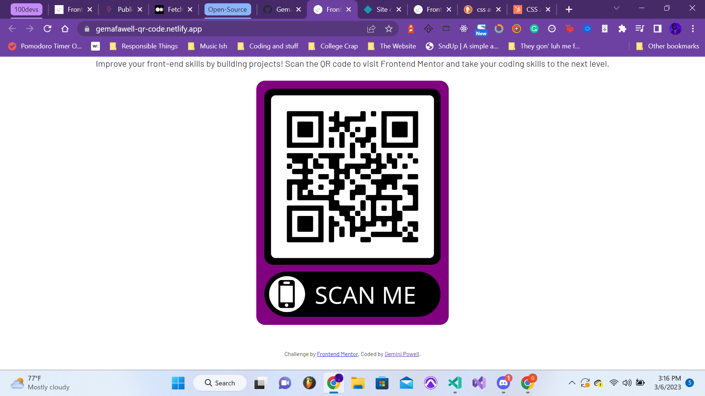

# Frontend Mentor - QR code component solution

This is a solution to the [QR code component challenge on Frontend Mentor](https://www.frontendmentor.io/challenges/qr-code-component-iux_sIO_H). Frontend Mentor challenges help you improve your coding skills by building realistic projects. 

## Table of contents

- [Overview](#overview)
  - [Screenshot](#screenshot)
  - [Links](#links)
- [My process](#my-process)
  - [Built with](#built-with)
  - [What I learned](#what-i-learned)
  - [Continued development](#continued-development)
  - [Useful resources](#useful-resources)
- [Author](#author)
- [Acknowledgments](#acknowledgments)

## Overview

### Screenshot

### Links

- Solution URL: [https://github.com/GemAfaWell/QR-Code-Component](https://github.com/GemAfaWell/QR-Code-Component)
- Live Site URL: [https://gemafawell-qr-code.netlify.app/](https://gemafawell-qr-code.netlify.app/)

## My process

You've got to start with the HTML - after adding the components there, into CSS we go to make it look pretty and give it an animation!

### Built with

- Semantic HTML5 markup
- CSS custom properties
- CSS animations
- Flexbox
- Mobile-first workflow

### What I learned

Styling isn't usually one of my strong suits - I was challenged with all of the new things I've learned with CSS over the last few months to truly style something similar to what I've seen, and I don't think I did a bad job, if I do say so myself.  

### Continued development

More front-end projects incoming!  I'm going to be working on a few more projects in the coming weeks, and I'm excited to see what I can do with them.

### Useful resources

- [CSS Animations](https://www.w3schools.com/css/css3_animations.asp) - got my animation instructions here!
- [CSS Flexbox](https://www.w3schools.com/css/css3_flexbox.asp) - I was torn between choosing block or flexbox, but I'm glad I went with flexbox in the end.

## Author

- [Gemini Powell](https://gemafawell.dev)
- [Frontend Mentor](https://www.frontendmentor.io/profile/gemafawell)
- [Twitter](https://www.twitter.com/GemAfaWell)
- [LinkedIn](https://www.linkedin.com/in/GemAfaWell)

## Acknowledgments

Shout-out to [Frontend Mentor](https://www.frontendmentor.io) for the challenge!  Also, big shout-out to Leon Noel - I've been walking through the 100Devs course with him, and he's been a huge help in my learning process.  I'm excited to see what I can do with the skills I've learned so far!
